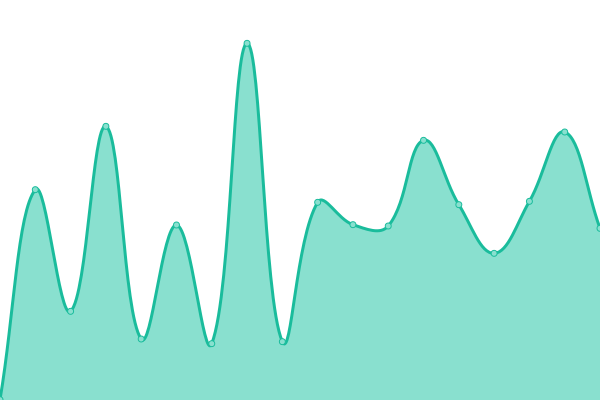
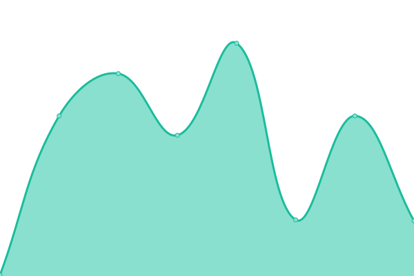

# 

This repository contains the open-source uptime monitor and status page for [Jupiter Project](https://jup.io), powered by [Upptime](https://github.com/upptime/upptime).

With [Upptime](https://upptime.js.org), you can get your own unlimited and free uptime monitor and status page, powered entirely by a GitHub repository. We use [Issues](https://github.com/jupiter-project/upptime/issues) as incident reports, [Actions](https://github.com/jupiter-project/upptime/actions) as uptime monitors, and [Pages](https://upptime.jup.io) for the status page.

<!--start: status pages-->
<!-- This summary is generated by Upptime (https://github.com/upptime/upptime) -->
<!-- Do not edit this manually, your changes will be overwritten -->
<!-- prettier-ignore -->
| URL | Status | History | Response Time | Uptime |
| --- | ------ | ------- | ------------- | ------ |
|  [Website](https://jup.io) | 🟩 Up | [website.yml](https://github.com/jupiter-project/upptime/commits/HEAD/history/website.yml) | 

 536ms
     
 | 

<a href="https://upptime.jup.io/history/website">100.00%</a>
    

|  [Blog](https://blog.jup.io) | 🟩 Up | [blog.yml](https://github.com/jupiter-project/upptime/commits/HEAD/history/blog.yml) | 

 933ms
     
 | 

<a href="https://upptime.jup.io/history/blog">100.00%</a>
    

|  [Web Wallet](https://nodes.jup.io) | 🟩 Up | [web-wallet.yml](https://github.com/jupiter-project/upptime/commits/HEAD/history/web-wallet.yml) | 

 321ms
     
 | 

<a href="https://upptime.jup.io/history/web-wallet">100.00%</a>
    

|  [Galileo Blockchain Stats](https://galileo.jup.io) | 🟩 Up | [galileo-blockchain-stats.yml](https://github.com/jupiter-project/upptime/commits/HEAD/history/galileo-blockchain-stats.yml) | 

 247ms
     
 | 

<a href="https://upptime.jup.io/history/galileo-blockchain-stats">100.00%</a>
    

|  [Project IPFS Gateway](https://gravity.jup.io/ipfs/QmSxJqjPsnHUY9XNBYWVTWHiQuXUvapZtDEL2tBkBSSNsE?filename=Layer%201-AnimatedJup%20(1).mp4) | 🟩 Up | [project-ipfs-gateway.yml](https://github.com/jupiter-project/upptime/commits/HEAD/history/project-ipfs-gateway.yml) | 

 824ms
     
 | 

<a href="https://upptime.jup.io/history/project-ipfs-gateway">100.00%</a>
    

|  Project IPFS API | 🟩 Up | [project-ipfs-api.yml](https://github.com/jupiter-project/upptime/commits/HEAD/history/project-ipfs-api.yml) | 

 283ms
     
 | 

<a href="https://upptime.jup.io/history/project-ipfs-api">99.70%</a>
    

<!--end: status pages-->

[**Visit our status website →**](https://upptime.jup.io)

## 📄 License

- Powered by: [Upptime](https://github.com/upptime/upptime)
- Code: [MIT](./LICENSE) © [Jupiter Project](https://jup.io)
- Data in the `./history` directory: [Open Database License](https://opendatacommons.org/licenses/odbl/1-0/)
